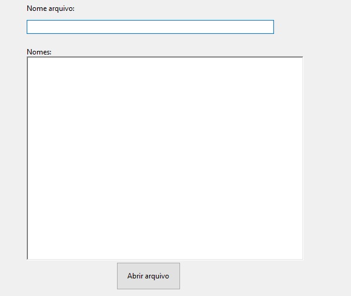

<!-- Badges -->
<p align="center">
  
  
  
  
  
</p>

##  Alterador de arquivos

O **Alterador de arquivos** é um conector de sistemas,desenvolvido em C# e Windows Forms .NET 7. Funcionalidade de transferencia de dados que não conversam via API: A partir um Excel, aplica transformações/mapeamentos e obtém um Excel pronto para inserção em outro sistema.

---

## 🚀 Funcionalidades Principais

- 📥 **Importação de Excel**: lê a primeira planilha de arquivos `.xlsx`.
- 🔄 **Transformação de Dados**: formata colunas, datas.
- 📂 **Mapeamento**: usa arquivos `.txt` na pasta `data/` para converter descrições em IDs.
- 💾 **Geração de Excel**: cria `.xlsx` com cabeçalhos padronizados para o sistema destino.
- 🛠️ **Interface Intuitiva**: selecione origem, nome do arquivo e cole corretores.

---

## ⚙️ Tecnologias

| Ferramenta      | Versão          |
|-----------------|-----------------|
| .NET SDK        | 7.0             |
| C#              | 10              |
| Windows Forms   | WinForms        |

---

## 📋 Pré-requisitos

1. 💻 Windows 10 ou superior
2. 🔧 [.NET 7.0 SDK](https://dotnet.microsoft.com/download)
3. 📝 Visual Studio 2022 ou VS Code

---

## 🏗️ Instalação

```bash
# 1. Clone o repositório
$ git clone https://github.com/pepes1234/AlterArchives.git
# 2. Entre na pasta principal
$ cd AlterArchives
# 3. Rodar o programa
$ dotnet run
```

---

## 🔧 Configuração

1. Crie a pasta `data/` com os arquivos de mapeamento:
   - `Corretores.txt`, `Fonte.txt`, `Modalidade.txt`, `Produto.txt`, `Status.txt`, `StatusMotivo.txt`
2. Formato dos `.txt` (sem cabeçalho):
   ```txt
   {ID};{Descrição};{Ativo}
   ```
3. Excel de origem: mínimo 31 colunas.

---

## ▶️ Uso

1. Em **Nome do arquivo**, digite o nome desejado (sem `.xlsx`).
<p align="center">
  
</p>
2. Cole as descrições de corretores em **Nomes** e clique em **Abrir arquivo**.
3. Selecione o Excel de origem.
4. Aguarde a mensagem **Sucesso!** e encontre o arquivo gerado na raiz.

---

## 📁 Estrutura do Projeto

```
AlterArchives/
├── data/                   # Arquivos de mapeamento (.txt)
├── Model/                  # Entidades (Formulario, Corretores, ...)
├── Services/               # Leitura e lógica de mapeamento (.txt)
├── Form1.cs                # Lógica do Windows Form
├── Form1.Designer.cs       # Layout do formulário
├── Program.cs              # Ponto de entrada
└── AlterArchives.sln       # Solução
```

---
